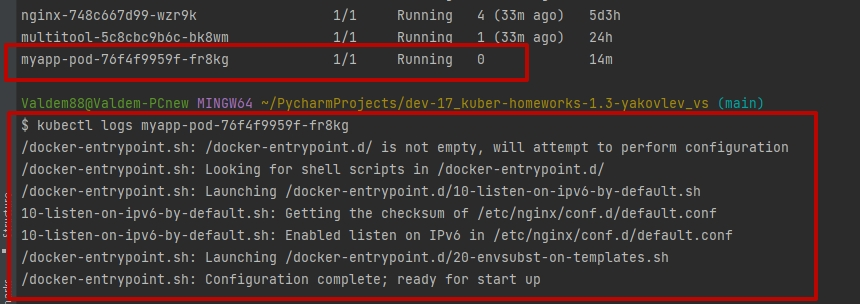

# Домашнее задание к занятию "Запуск приложений в K8S" - dev-17_kuber-homeworks-1.3-yakovlev_vs
homeworks-1.3

### Цель задания

В тестовой среде для работы с Kubernetes, установленной в предыдущем ДЗ, необходимо развернуть Deployment с приложением, состоящим из нескольких контейнеров и масштабировать его.

------

### Чеклист готовности к домашнему заданию

1. Установленное k8s-решение (например, MicroK8S)
2. Установленный локальный kubectl
3. Редактор YAML-файлов с подключенным git-репозиторием

------

### Инструменты/ дополнительные материалы, которые пригодятся для выполнения задания

1. [Описание](https://kubernetes.io/docs/concepts/workloads/controllers/deployment/) Deployment и примеры манифестов
2. [Описание](https://kubernetes.io/docs/concepts/workloads/pods/init-containers/) Init-контейнеров
3. [Описание](https://github.com/wbitt/Network-MultiTool) Multitool

------

### Задание 1. Создать Deployment и обеспечить доступ к репликам приложения из другого Pod'а

#### Решение

1. Создать Deployment приложения состоящего из двух контейнеров - nginx и multitool. Решить возникшую ошибку
- мой файл Deployment. Создает Deployment приложения nginx, multitool и сервис nginx-svc привязанный к Deployment nginx по метке labels.
```yaml
apiVersion: apps/v1
kind: Deployment
metadata:
  name: netology-deployment
  labels:
    app: main
spec:
  replicas: 1
  selector:
    matchLabels:
      app: main
  template:
    metadata:
      labels:
        app: main
    spec:
      containers:
      - name: nginx
        image: nginx:1.19.1
        ports:
        - containerPort: 80
---

apiVersion: apps/v1
kind: Deployment
metadata:
  name: multitool
  labels:
    app: multitool
  namespace: default
spec:
  replicas: 1
  selector:
    matchLabels:
      app: multitool
  template:
    metadata:
      labels:
        app: multitool
    spec:
      containers:
        - image: wbitt/network-multitool
          imagePullPolicy: IfNotPresent
          name: network-multitool
          resources:
            limits:
              cpu: 200m
              memory: 512Mi
            requests:
              cpu: 100m
              memory: 256Mi
---

apiVersion: v1
kind: Service
metadata:
  name: nginx-svc
spec:
  ports:
    - name: web
      port: 80
  selector:
    app: main
```
```bash
$ kubectl get deployments
NAME                  READY   UP-TO-DATE   AVAILABLE   AGE
netology-deployment   1/1     1            1           26m
multitool             1/1     1            1           64s
$ kubectl get svc
NAME           TYPE        CLUSTER-IP       EXTERNAL-IP   PORT(S)    AGE
kubernetes     ClusterIP   10.152.183.1     <none>        443/TCP    4d3h
nginx-svc      ClusterIP   10.152.183.128   <none>        80/TCP     6m35s
```
2. После запуска увеличить кол-во реплик работающего приложения до 2

Увеличиваем параметр `replicas: 2`

```bash
$ kubectl get deployments
NAME                  READY   UP-TO-DATE   AVAILABLE   AGE 
multitool             1/1     1            1           10m
netology-deployment   2/2     2            2           36m
```

3. Продемонстрировать кол-во подов до и после масштабирования
- до 

```bash
$ kubectl get pods
NAME                                   READY   STATUS    RESTARTS       AGE
netology-deployment-66948488df-8jxdd   1/1     Running   0              34m
multitool-5c8cbc9b6c-bk8wm             1/1     Running   0              9m
```

- после
```bash
$ kubectl get pods
NAME                                   READY   STATUS    RESTARTS       AGE
netology-deployment-66948488df-8jxdd   1/1     Running   0              38m
multitool-5c8cbc9b6c-bk8wm             1/1     Running   0              13m
netology-deployment-66948488df-vbwhs   1/1     Running   0              2m45s 
```

4. Создать Service, который обеспечит доступ до реплик приложений из п.1
```bash
$ kubectl get svc
NAME           TYPE        CLUSTER-IP       EXTERNAL-IP   PORT(S)    AGE
kubernetes     ClusterIP   10.152.183.1     <none>        443/TCP    4d3h
netology-svc   ClusterIP   10.152.183.100   <none>        8080/TCP   20h
nginx-svc      ClusterIP   10.152.183.128   <none>        80/TCP     16m
```
5. Создать отдельный Pod с приложением multitool и убедиться с помощью `curl` что из пода есть доступ до приложений из п.1

```bash
$ kubectl exec multitool-5c8cbc9b6c-bk8wm -- curl 10.152.183.128
<!DOCTYPE html>
<html>
<head>
<title>Welcome to nginx!</title>
<style>
    body {
        width: 35em;
        margin: 0 auto;
        font-family: Tahoma, Verdana, Arial, sans-serif;
    }
</style>
</head>
<body>
<h1>Welcome to nginx!</h1>
<p>If you see this page, the nginx web server is successfully installed and
working. Further configuration is required.</p>

<p>For online documentation and support please refer to
<a href="http://nginx.org/">nginx.org</a>.<br/>
Commercial support is available at
<a href="http://nginx.com/">nginx.com</a>.</p>

<p><em>Thank you for using nginx.</em></p>
</body>
</html>
  % Total    % Received % Xferd  Average Speed   Time    Time     Time  Current
                                 Dload  Upload   Total   Spent    Left  Speed
100   612  100   612    0     0   440k      0 --:--:-- --:--:-- --:--:--  597k
```

------

### Задание 2. Создать Deployment и обеспечить старт основного контейнера при выполнении условий

#### Решение

1. Создать Deployment приложения nginx и обеспечить старт контейнера только после того, как будет запущен сервис этого приложения

-  [Deployment.nginx.yaml](main/nginx.yaml)

2. Убедиться, что nginx не стартует. В качестве init-контейнера взять busybox

-  При старте deployment пишет ошибку. В ожидании запуска 

```bash
$ kubectl logs myapp-pod-76f4f9959f-fr8kg
Error from server (BadRequest): container "nginx" in pod "myapp-pod-76f4f9959f-fr8kg" is waiting to start: PodInitializing

$ kubectl get pods
NAME                                   READY   STATUS     RESTARTS      AGE
netology-deployment-66948488df-vbwhs   1/1     Running    1 (33m ago)   24h
netology-deployment-66948488df-8jxdd   1/1     Running    1 (33m ago)   25h
nginx-748c667d99-wzr9k                 1/1     Running    4 (33m ago)   5d3h
multitool-5c8cbc9b6c-bk8wm             1/1     Running    1 (33m ago)   24h
myapp-pod-76f4f9959f-fr8kg             0/1     Init:0/1   0             14m
```

3. Создать и запустить Service. Убедиться, что nginx запустился

- [myservice.yaml](main/myservice.yaml)

4. Продемонстрировать состояние пода до и после запуска сервиса

- после создания сервиса под автоматически поднялся 

```bash
$ kubectl apply -f main/myservice.yaml 
service/myservice created
$ kubectl get pods
NAME                                   READY   STATUS    RESTARTS      AGE
netology-deployment-66948488df-vbwhs   1/1     Running   1 (33m ago)   24h
netology-deployment-66948488df-8jxdd   1/1     Running   1 (33m ago)   25h
nginx-748c667d99-wzr9k                 1/1     Running   4 (33m ago)   5d3h
multitool-5c8cbc9b6c-bk8wm             1/1     Running   1 (33m ago)   24h
myapp-pod-76f4f9959f-fr8kg             1/1     Running   0             14m
```



------

### Правила приема работы

1. Домашняя работа оформляется в своем Git репозитории в файле README.md. Выполненное домашнее задание пришлите ссылкой на .md-файл в вашем репозитории.
2. Файл README.md должен содержать скриншоты вывода необходимых команд `kubectl`, а также скриншоты результатов
3. Репозиторий должен содержать файлы манифестов и ссылки на них в файле README.md

------